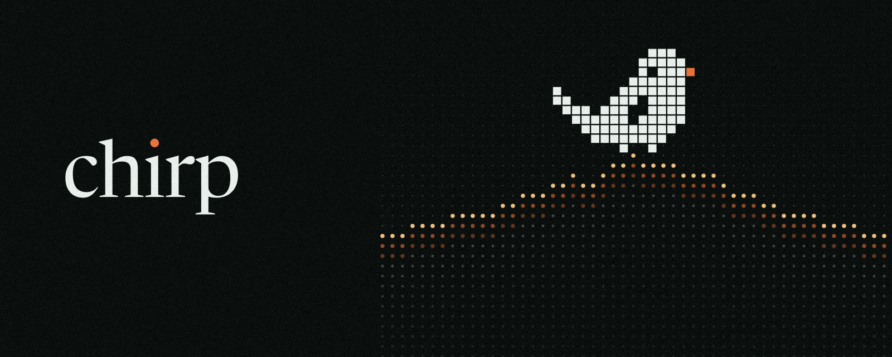

  

<h3 align="center">Say it once.</h3>

  Private speech to text for your Mac. Hold a key, talk, and Chirp types what
  you said into whatever app you're in.

  
  

  <a href="https://github.com/methunrajmani85-del/Chirp-releases/releases/latest"><strong>Download Chirp for Mac</strong></a>
  &nbsp;·&nbsp;
  <a href="https://github.com/methunrajmani85-del/Chirp-releases/releases">Release notes</a>

---

## Install

1. Open the [latest release](https://github.com/methunrajmani85-del/Chirp-releases/releases/latest)
   and download **`Chirp-<version>.dmg`** under *Assets*.
2. Open the disk image and drag **Chirp** to **Applications**.
3. Open Chirp and follow the short tour. It asks for the microphone and
   Accessibility, then you're ready to talk.

Prefer an installer? **`Chirp-<version>.pkg`** puts the same app in
Applications, which is handy when you set up several Macs.

Both are signed with a Developer ID and notarised by Apple.

### Requirements

- macOS 14 Sonoma or later.
- An Apple silicon Mac is recommended. Intel Macs work too, but on-device
  speech engines run without the Neural Engine and are slower.
- The Apple Speech engine needs macOS 26 or later. The other engines don't.

### Permissions

| Permission | Why |
| --- | --- |
| Microphone | Chirp listens only while you hold your dictation key. |
| Accessibility | To paste your words into the app you're using. |

Calendar, Bluetooth, Downloads, Screenshots and project folders are asked for
only when you switch on the part of Chirp that uses them.

## What it does

**Say it.** Hold your dictation key, talk, let go. Your words land in the app
you started in, formatted for it. Double-tap the key to keep recording
hands-free.

**Fixed.** "Tuesday — no, Wednesday" becomes "Wednesday". Spoken formatting
("new line", "bullet"), your dictionary and confident spelling fixes, with
Undo. Code, paths and links are never changed.

**Knows your code.** Add a project and say "look at the app delegate file":
Claude Code and Codex get `@App/AppDelegate.swift`, Cursor's chat
`@AppDelegate.swift`, Slack `` `AppDelegate.swift` ``. Identifiers come out
cased — "handle commit" becomes `handleCommit`.

**At a glance.** The notch becomes the island: dictation, Now Playing, a tray
for files and links, clipboard history, your next meeting, a focus timer, and
your Claude Code and Codex sessions. Every part switches off on its own. On a
Mac without a notch, Chirp draws one when there's something to show.

**Voice commands.** Hold your dictation key with Shift and say "timer
twenty-five minutes" or "paste the link I copied from Safari". About forty
commands work offline. AirDrop, deleting things and allowing an agent always
wait for your tap.

Everything new in each version is in the
[release notes](https://github.com/methunrajmani85-del/Chirp-releases/releases).

## Privacy

- **On this Mac by default.** Speech becomes text on your Mac. A cloud engine
  is used only if you connect one, and Chirp shows "This Mac" or "Cloud"
  while it writes.
- **Never into a password field.** Private dictation, in the menu bar, keeps,
  learns and sends nothing.
- **Your code stays put.** Project indexes live on your Mac. Secrets, `.env`
  files and anything git ignores are never read.
- **You can see it all.** Settings → Privacy & data shows what Chirp keeps,
  for how long and where your words go, and deletes any of it.

## Updates

Chirp checks this page for a new release when it opens, at most once a day.
It installs the update in the background and asks before restarting — never
mid-dictation. Either can be switched off in Settings → Updates, where
**Check now** looks straight away and the version you have is shown.

## Uninstall

Open Settings → Access and choose **Uninstall Chirp…**. It removes the app,
its speech models and its permissions. Dragging Chirp to the Trash leaves
those behind.

## Report a problem

[Open an issue](https://github.com/methunrajmani85-del/Chirp-releases/issues/new/choose)
with your Chirp version (Settings → Updates), your macOS version and what you
expected to happen.

---

This repository publishes Chirp's signed installers and release notes.
Chirp is Mac only; the Windows app ended at 1.2.0 and is no longer
updated.
